# EventHub — Use Case Diagram

```mermaid
graph LR

    Guest(["👤 Guest"])
    Attendee(["👤 Attendee"])
    Organizer(["👤 Organizer"])
    Admin(["👤 Admin"])

    subgraph EventHub Platform

        subgraph "Authentication"
            UC1("Register / Login")
            UC2("Manage Profile")
        end

        subgraph "Event Discovery"
            UC3("Browse & Search Events")
            UC4("Filter by Category / Date")
            UC5("View Event Details")
        end

        subgraph "Ticketing & Registration"
            UC6("RSVP / Register for Event")
            UC7("Cancel Registration")
            UC8("View My Tickets")
            UC9("Mock Payment")
        end

        subgraph "Integrations"
            UC10("Add to Google Calendar")
            UC11("View Event on Map")
        end

        subgraph "Event Management"
            UC12("Create / Edit Event")
            UC13("Set Capacity & Tickets")
            UC14("View & Export Attendees")
            UC15("Track RSVP Status")
        end

        subgraph "Admin & Moderation"
            UC16("Approve / Reject Event")
            UC17("Moderate / Remove Event")
            UC18("Manage Users")
            UC19("View Analytics")
        end

        subgraph "Notifications"
            UC20("Registration Confirmation")
            UC21("Event Reminders")
            UC22("Event Update / Cancellation")
        end

    end

    Guest --> UC1
    Guest --> UC3
    Guest --> UC4
    Guest --> UC5

    Attendee --> UC2
    Attendee --> UC6
    Attendee --> UC7
    Attendee --> UC8
    Attendee --> UC9
    Attendee --> UC10
    Attendee --> UC11
    Attendee --> UC20
    Attendee --> UC21

    Organizer --> UC12
    Organizer --> UC13
    Organizer --> UC14
    Organizer --> UC15
    Organizer --> UC22

    Admin --> UC16
    Admin --> UC17
    Admin --> UC18
    Admin --> UC19

    classDef actor fill:#dbeafe,stroke:#3b82f6,color:#1e3a5f
    class Guest,Attendee,Organizer,Admin actor
```

## Actor Roles

| Actor | Can Do |
|---|---|
| **Guest** | Browse, search, filter, and view event details |
| **Attendee** | All of Guest + RSVP, tickets, calendar, map, notifications |
| **Organizer** | All of Attendee + create/manage events, view attendees |
| **Admin** | All of Attendee + approve events, moderate, manage users |
